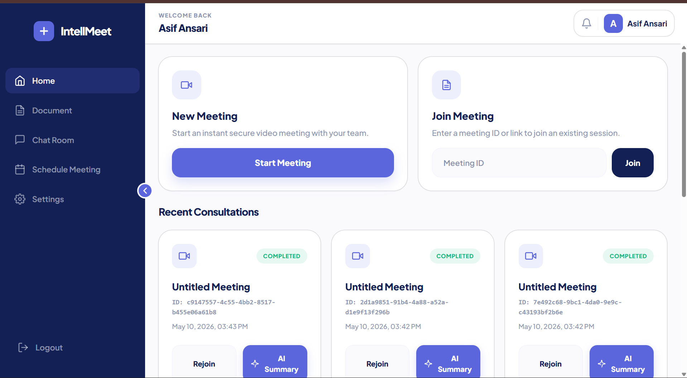
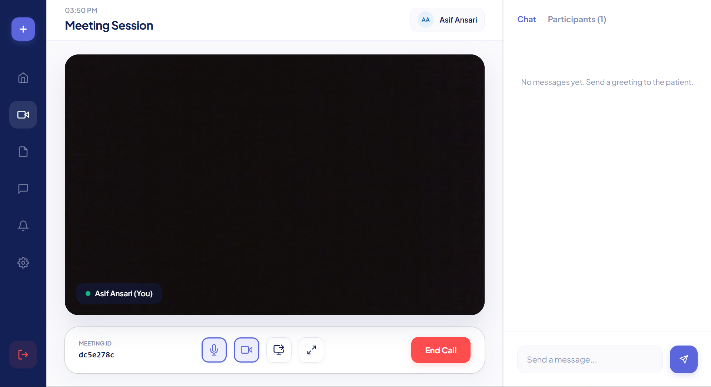
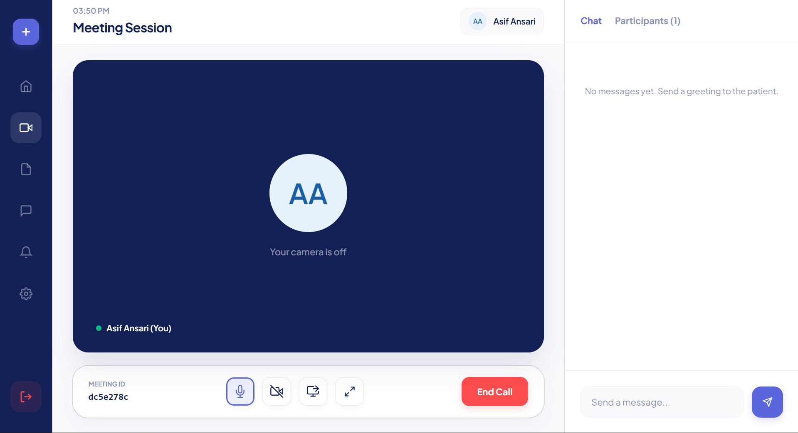

IntellMeet – AI-Powered Enterprise Meeting & Collaboration Platform
---------------------------------------------------------------------------------------------------------
Real-Time Video Meetings • AI Summaries • Smart Action Items • Team Collaboration

Production-Grade Full-Stack MERN Application with WebRTC, Socket.io, and AI Meeting Intelligence

Overview
---------------------------------------------------------------------------------------------------------
IntellMeet is a full-stack AI-powered meeting and collaboration platform built using the MERN stack. It enables users to create and join real-time video meetings, collaborate through live chat, share screens, and generate AI-powered meeting summaries with actionable insights.

The project focuses on real-time communication, scalable architecture, modern UI/UX, and AI meeting intelligence.

 
Screenshots
---------------------------------------------------------------------------------------------------------

# Screenshots

Features
---------------------------------------------------------------------------------------------------------
Authentication System
User registration and login
JWT-based authentication
Password hashing with bcrypt
Protected API routes
Secure session handling

Real-Time Video Meetings
---------------------------------------------------------------------------------------------------------
WebRTC peer-to-peer video/audio calls
Camera and microphone controls
Real-time participant communication
Room-based meeting system
Multi-user support (in progress)

Real-Time Chat
---------------------------------------------------------------------------------------------------------
Live messaging using Socket.io
Typing indicators
Instant communication
Real-time room synchronization

Screen Sharing
---------------------------------------------------------------------------------------------------------
Share entire screen/window/tab
Dynamic stream replacement using replaceTrack()
Automatic camera restoration after sharing

AI Meeting Intelligence
---------------------------------------------------------------------------------------------------------
AI-generated meeting summaries
Action item extraction
Smart meeting insights
Transcript-based AI processing
OpenAI API integration

Dashboard & Meeting History
---------------------------------------------------------------------------------------------------------
Create and join meetings
Meeting history tracking
AI summary viewing
Action item management
Responsive dashboard UI

Tech Stack
---------------------------------------------------------------------------------------------------------
Frontend
---------------------------------------------------------------------------------------------------------
React + Vite
Tailwind CSS
React Router
Axios
Zustand
Socket.io-client

Backend
---------------------------------------------------------------------------------------------------------
Node.js
Express.js
MongoDB Atlas
Mongoose
JWT Authentication
bcryptjs
Socket.io
UUID

Real-Time & Media
---------------------------------------------------------------------------------------------------------
WebRTC
RTCPeerConnection
getUserMedia API
getDisplayMedia API
---------------------------------------------------------------------------------------------------------
AI Integration
OpenAI API

Project Architecture
---------------------------------------------------------------------------------------------------------
Client (React + Vite)
        │
        ▼
Socket.io Client ───────► Socket.io Server
        │                         │
        ▼                         ▼
 WebRTC Peer Connection     Express Backend
        │                         │
        ▼                         ▼
 Real-Time Media         MongoDB Atlas Database
                                │
                                ▼
                           OpenAI API
                           
Project Structure
---------------------------------------------------------------------------------------------------------

IntellMeet/
│
├── client/
│   ├── src/
│   │   ├── components/
│   │   ├── pages/
│   │   ├── services/
│   │   ├── hooks/
│   │   ├── store/
│   │   ├── App.jsx
│   │   └── main.jsx
│
├── server/
│   ├── config/
│   ├── controllers/
│   ├── middleware/
│   ├── models/
│   ├── routes/
│   ├── sockets/
│   ├── services/
│   ├── .env
│   └── server.js
│
├── README.md
└── package.json

Installation & Setup
---------------------------------------------------------------------------------------------------------
1. Clone Repository
 ---------------------------------------------------------------------------------------------------------
git clone https://github.com/yourusername/IntellMeet.git

cd IntellMeet

3. Setup Backend
---------------------------------------------------------------------------------------------------------
cd server

Install dependencies:
---------------------------------------------------------------------------------------------------------
npm install

Create .env
---------------------------------------------------------------------------------------------------------
PORT=5000
MONGO_URI=your_mongodb_connection
JWT_SECRET=your_secret
OPENAI_API_KEY=your_openai_key
CLIENT_URL=http://localhost:5173

Run backend:
---------------------------------------------------------------------------------------------------------
npm run dev

3. Setup Frontend
---------------------------------------------------------------------------------------------------------
Open another terminal:
---------------------------------------------------------------------------------------------------------
cd client

Install dependencies:
---------------------------------------------------------------------------------------------------------
npm install

Run frontend:
---------------------------------------------------------------------------------------------------------
npm run dev

Environment Variables
---------------------------------------------------------------------------------------------------------
Backend .env
---------------------------------------------------------------------------------------------------------
PORT=
MONGO_URI=
JWT_SECRET=
OPENAI_API_KEY=
CLIENT_URL=
---------------------------------------------------------------------------------------------------------
API Endpoints
---------------------------------------------------------------------------------------------------------
Authentication
---------------------------------------------------------------------------------------------------------
Method	Endpoint	Description
POST	/api/auth/register	Register user
POST	/api/auth/login	Login user

Meetings
---------------------------------------------------------------------------------------------------------
Method	Endpoint	Description
---------------------------------------------------------------------------------------------------------
POST	/api/meetings	Create meeting
GET	/api/meetings	Get meetings
POST	/api/meetings/join/:roomId	Join meeting

AI Features
---------------------------------------------------------------------------------------------------------
Method	Endpoint	Description
---------------------------------------------------------------------------------------------------------
POST	/api/meetings/:id/generate-summary	Generate AI summary

Socket.io Events
---------------------------------------------------------------------------------------------------------
Client → Server
---------------------------------------------------------------------------------------------------------
join-room
send-message
typing
offer
answer
ice-candidate

Server → Client
---------------------------------------------------------------------------------------------------------
receive-message
user-joined
user-left
typing
offer
answer
ice-candidate

AI Workflow
---------------------------------------------------------------------------------------------------------

Meeting Chat / Transcript
            ↓
      OpenAI API
            ↓
    AI Meeting Summary
            ↓
   Action Item Extraction
            ↓
     Save to MongoDB
            ↓
 Display in Dashboard

Security Features
---------------------------------------------------------------------------------------------------------
JWT authentication
Password hashing using bcrypt
Protected routes
Environment variable protection
Secure API handling
Socket room isolation

Responsive Design
---------------------------------------------------------------------------------------------------------
Mobile responsive UI
Tablet support
Desktop optimized
Flexible layouts using Tailwind CSS

Future Improvements
---------------------------------------------------------------------------------------------------------
AI live transcription
Meeting recording
Notifications system
Multi-user WebRTC scaling
Team workspace
Kanban task board
Docker deployment
CI/CD pipeline
Performance analytics

Testing
---------------------------------------------------------------------------------------------------------
Manual Testing
Authentication flow
Real-time chat
WebRTC calls
Screen sharing
AI summary generation

Deployment
---------------------------------------------------------------------------------------------------------
Suggested Platforms
Frontend
---------------------------------------------------------------------------------------------------------
Vercel
Netlify

Backend
---------------------------------------------------------------------------------------------------------
Render
Railway

Database
---------------------------------------------------------------------------------------------------------
MongoDB Atlas

Key Learnings
---------------------------------------------------------------------------------------------------------
Real-time communication using Socket.io
Peer-to-peer media streaming with WebRTC
Authentication & authorization
AI integration with OpenAI
Full-stack MERN architecture
State management and scalable frontend structure

Author
---------------------------------------------------------------------------------------------------------
Asif Ansari

Full-Stack MERN Developer

License

This project is built for educational, portfolio, and internship purposes.

Acknowledgements
---------------------------------------------------------------------------------------------------------
OpenAI
Socket.io
WebRTC
MongoDB Atlas
React
Tailwind CSS
Contact

If you found this project useful, consider starring the repository.
